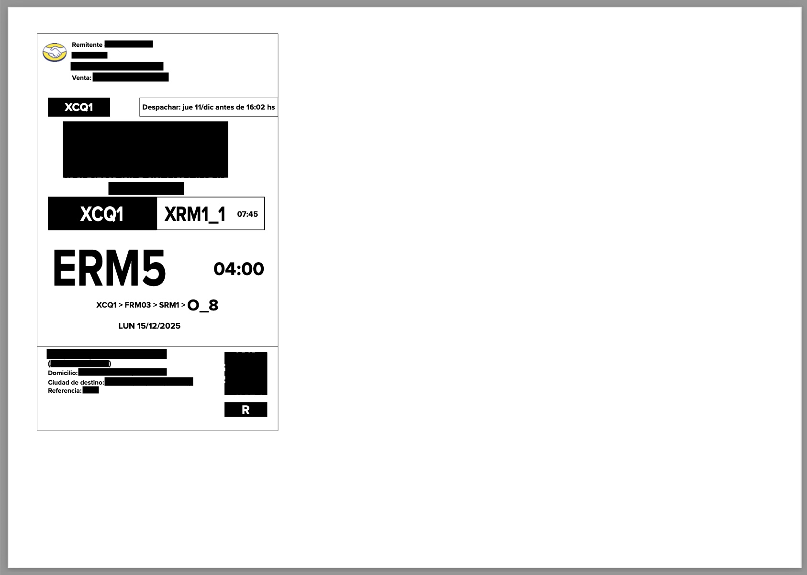
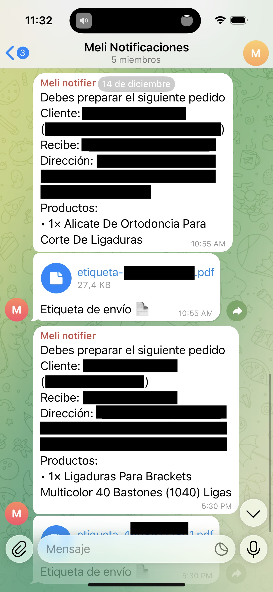
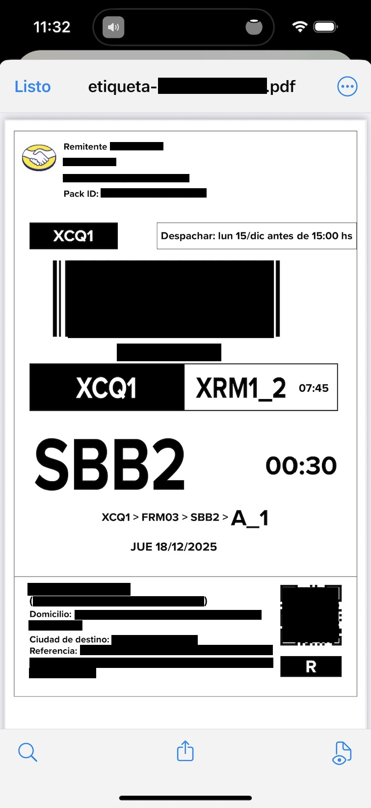
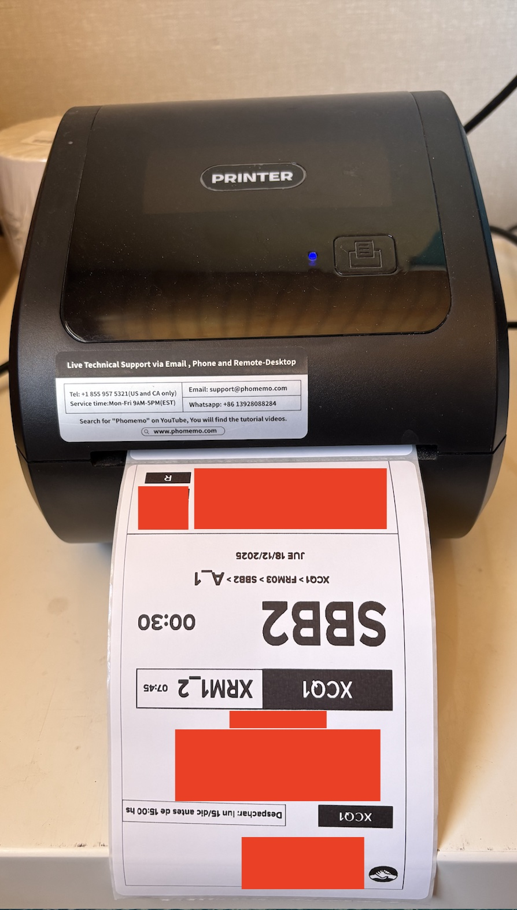

## Meli Notifier Bot – Shipping Automation (MVP)

MercadoLibre notification bot based on an **event-driven architecture**, built with **AWS CDK (Lambda, API Gateway, SQS, DynamoDB y Secrets Manager)**.
It processes webhooks and sends real-time updates to **Telegram**.
Developed using **Node.js** and **TypeScript**.

The goal is to drastically reduce shipment preparation time, especially in workflows with a high daily volume.

## MVP Motivation

In the daily operations of a MercadoLibre seller, printing and adjusting shipping labels consumes repetitive time:

### Original Flow (2–3 minutes per order)

1. Open MercadoLibre (web or app).

2. Go to notifications or sales.

3. Open the corresponding order.

4. Download the PDF shipping label.

5. Crop the label
   (the PDF label uses only about 30% of the page, leaving a large amount of blank space that must be manually removed before sending it to the thermal printer).



6. Print using the thermal printer app.

### Optimized Flow with This Project (< 1 minute)

1. Open the bot notification in Telegram.

2. Download the label already cropped by the backend.

3. Print directly from the thermal printer app.

With this MVP, the processing time is reduced to **under 1 minute**, resulting in significant daily operational savings (e.g. **20 orders → +40 minutes/day**).

## Telegram Notification Example

Note: Personal data has been anonymized for privacy reasons.



## Thermal Printing Result

Label ready to be printed directly on a thermal printer, with no manual cropping required.

 

## Architecture

- **AWS API Gateway**: Receives MercadoLibre webhooks.
- **AWS Lambda (Producer)**: Validates requests and sends events to SQS.
- **AWS SQS**: Decouples and buffers the processing flow.
- **AWS Lambda (Worker)**:
  - Fetches orders and shipments from the MercadoLibre API.
  - Sends notifications to Telegram.
  - Downloads and crops PDF labels using pdf-lib.
- **DynamoDB**: Event deduplication (idempotency).
- **Secrets Manager**: Stores MercadoLibre API tokens.

## Key Features

- MercadoLibre webhook reception.
- Idempotent event processing.
- Retrieval of order and shipment details.
- Intelligent detection of the logistics type.
- Enriched Telegram messages including: customer, address, products, and logistics type.
- Automatic cropping of PDF labels for thermal printers.
- Delivery of print-ready shipping labels.

## Project Structure

```bash
    infra/                  # CDK: (Lambda, SQS, DynamoDB, Secrets Manager)
    src/
        application/        # Domain logic and use cases
            mercadolibre/   # MercadoLibre integrations: token, messages, label cropping
        functions/          # Lambda functions (producer and worker)
        infrastructure/     # Adapters for DynamoDB, HTTP, Telegram, MercadoLibre API
    tests/                  # Unit tests
```

## Technologies

- **Node.js + TypeScript**
- **AWS Lambda**
- **AWS SQS**
- **AWS DynamoDB**
- **AWS CDK**
- **AWS Secrets Manager**
- **pdf-lib**
- **Telegram Bot API**
- **MercadoLibre API**

## Technical Highlights

- Event-driven architecture using AWS Lambda, SQS, and API Gateway.
- Idempotent persistence with DynamoDB.
- Secrets Manager for secure credential management.
- Typed and modular MercadoLibre API client.
- CI/CD with GitHub Actions running tests on every push.
- Unit test suite written in TypeScript.
- Decoupled delivery of Telegram notifications.
- Automatic PDF label cropping using `pdf-lib`.

## Author

Claudio Andrade - Full-Stack Software Engineer

claudioandradecor@gmail.com
